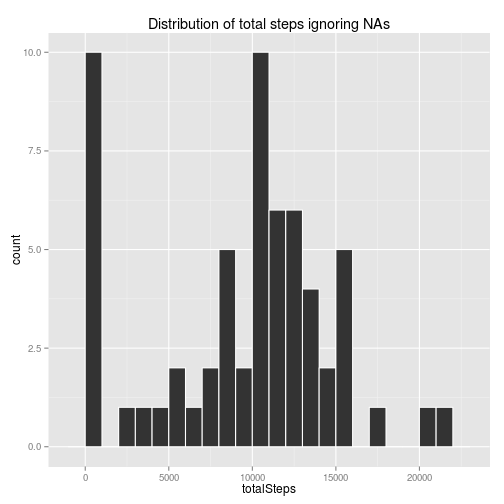
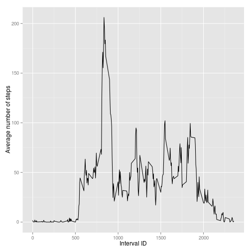
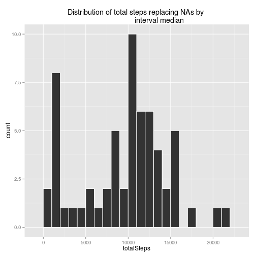
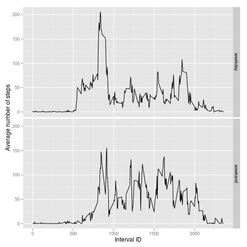

## Loading and preprocessing the data
For data wrangling, I like to use **dplyr** library. For graphics, I like the
**ggplot2** library.

```r
library(dplyr)
library(ggplot2)
```

First we load the data (we have to unzip it). According to instructions, NA 
values are encoded as NA, so no need to worry about it. The data is converted
into a data frame tbl for convenient use with dplyr.

```r
dat <- tbl_df(read.csv(file = unz("activity.zip", "activity.csv"),
                       colClasses =  c("numeric","Date","numeric")))
```

I need to set the locale into English for the international audience :-)

```r
Sys.setlocale('LC_TIME', 'en_US.UTF-8')
```

```
## [1] "en_US.UTF-8"
```


## What is mean total number of steps taken per day?
First we create a table with the total number of steps taken each day, ignoring NAs.

```r
spd <- dat %>%
    group_by(date) %>%
    summarise(totalSteps = sum(steps, na.rm = TRUE))
```

We then make a histogram of the total number of steps taken each day.

```r
g_totalSteps <- ggplot(spd, aes(totalSteps)) +
                geom_histogram(color="white", binwidth = 1000) +
                labs(title = "Distribution of total steps ignoring NAs")
print(g_totalSteps)
```

 

The mean and median of the total number of steps taken per day:

```r
mean(spd$totalSteps)
```

```
## [1] 9354.23
```

```r
median(spd$totalSteps)
```

```
## [1] 10395
```


## What is the average daily activity pattern?
First we create a table with the average number of steps taken each 5-minutes 
interval, across all days, ignoring NAs.

```r
spi <- dat %>%
    group_by(interval) %>%
    summarise(averageSteps = mean(steps, na.rm = TRUE))
```

We then make a time series plot of the avearge of steps taken each 5-minutes 
interval, across all days.

```r
g_averageSteps <- ggplot(spi, aes(x = interval, y = averageSteps)) +
                  geom_line() +
                  labs(x = "Interval ID", y = "Average number of steps")
print(g_averageSteps)
```

 

The 5-minutes interval(s), on average across all the days in the dataset, which 
contains the maximum number of steps is:

```r
m <- max(spi$averageSteps)
filter(spi, averageSteps == m)
```

```
## Source: local data frame [1 x 2]
## 
##   interval averageSteps
## 1      835     206.1698
```


## Imputing missing values
The total number of missing values is:

```r
sum(is.na(dat$steps))
```

```
## [1] 2304
```

We decide to fill the missing values by setting them to the median of the
5-miunutes interval across all the days. We create a new data set **dat2**.


First we create a table with the median number of steps taken each 5-minutes 
interval, across all days, ignoring NAs.

```r
intMedians <- dat %>%
              group_by(interval) %>%
              summarise(medianSteps = median(steps, na.rm = TRUE))
```

We then add a column to **dat** which indicate the median number of steps by
interval:

```r
dat <- left_join(dat, intMedians)
```

```
## Joining by: "interval"
```

Finally, we create **dat2** by replacing each NA with the median value. We make
**dat2** equivalent to the original dataset by deleting the last column.

```r
dat2 <- dat
dat2[is.na(dat2$steps),"steps"] <- dat2[is.na(dat2$steps),"medianSteps"]
dat2 <- transmute(dat2, steps = steps, date = date, interval = interval)
```

Using **dat2** We do the same computation we did with **dat** :

```r
spd2 <- dat2 %>%
        group_by(date) %>%
        summarise(totalSteps = sum(steps, na.rm = TRUE))

g_totalSteps2 <- ggplot(spd2, aes(totalSteps)) +
                 geom_histogram(color="white", binwidth = 1000) +
                 labs(title = "Distribution of total steps replacing NAs by 
                      interval median")
print(g_totalSteps2)
```

 

The mean and median of the total number of steps taken per day:

```r
mean(spd2$totalSteps)
```

```
## [1] 9503.869
```

```r
median(spd2$totalSteps)
```

```
## [1] 10395
```

We therefore observe that after replacing NAs by interval median:

- the mean is larger by 1.5996972 %
- the median stays the same
- the overall distribution seams shifted on the right (larger values)

## Are there differences in activity patterns between weekdays and weekends?

First we create a tbl data frame which associates for each day of the week 
the value *weekday* or *weekend* accordingly.

```r
dataDays <- tbl_df(data.frame(day = c("Monday", "Tuesday", "Wednesday", 
                                      "Thursday", "Friday", "Saturday", 
                                      "Sunday"),
                              dayType = c(rep("weekday", 5), 
                                          rep("weekend", 2))))
```

We then add a new column to **data2** indicating what day of the week it is.

```r
dat2 <- mutate(dat2, day = as.factor(weekdays(date)))
```

Finally we combine the two dataframe with a left join.

```r
dat2 <- left_join(x = dat2, dataDays)
```

```
## Joining by: "day"
```

We are now able to do a panel plot according to the type of days.  
First we compute the mean number of steps by dayType and interval.

```r
spi2 <- dat2 %>%
        group_by(dayType, interval) %>%
        summarise(averageSteps = mean(steps, na.rm = TRUE))
```

We then make a time series plot of the avearge of steps taken each 5-minutes 
interval, by type of day.

```r
g_averageSteps2 <- ggplot(spi2, aes(x = interval, y = averageSteps)) +
                   geom_line() +
                   facet_grid(dayType ~ .) +
                   labs(x = "Interval ID", y = "Average number of steps")
print(g_averageSteps2)
```

 

We observe that during weekdays, people in the sample tend to walk more in the
morning and relatively less during the day whereas in the weekend, the number of
steps is more equally distributed.
